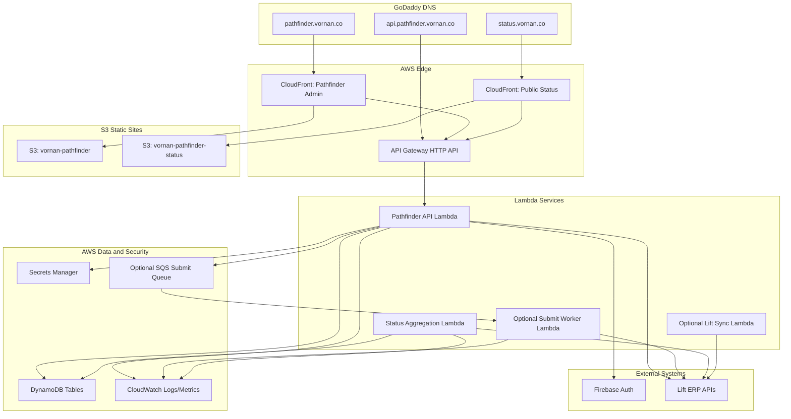

# Pathfinder AWS Production Hosting and Public Status Plan

**Status:** Draft execution plan  
**Created:** 2026-07-16  
**Target timing:** Complete first production-ready deployment path by early next week  
**Related docs:** `PATHFINDER_SUPERDOC_Volume_43_Deployment_Architecture_and_DevOps.md`, `PATHFINDER_SUPERDOC_Volume_34_Security_Architecture.md`, `FIRST_LIFT_SANDBOX_SUBMIT_READINESS.md`, `LIFT_ORDER_LOOKUP_ENDPOINTS.md`

## 1. Purpose

This document captures the recommended production architecture for hosting Pathfinder in AWS and exposing two branded Vornan domains:

- `pathfinder.vornan.co` for the authenticated internal Pathfinder admin/operator app.
- `status.vornan.co` for public, tokenized customer order-status pages.

The plan assumes:

- AWS is the preferred production hosting environment.
- Lift ERP endpoints are web-accessible from AWS Lambda, consistent with existing LTL applications.
- Firebase Auth is already used in other apps and should continue to provide Google authentication.
- `vornan.co` DNS is owned in GoDaddy.
- Pathfinder currently runs locally with a Vite web app and Express/local JSON API, which must be productionized.

## 2. Recommended Domain Model

### 2.1 Internal Admin App

`pathfinder.vornan.co`

Purpose:

- Authenticated Vornan/LTL operator workspace.
- Customer setup.
- Import methods.
- Manual imports.
- Output routes and targets.
- Product mapping.
- Lift submit preflight and submit attempts.
- Job review and operational audit.

Access:

- Requires Firebase Google Auth.
- Allowed email domains:
  - `ltlco.com`
  - `vornan.co`
- Backend must verify Firebase ID tokens and enforce the domain allowlist. Client-side checks alone are not sufficient.

### 2.2 Public Order Status App

`status.vornan.co`

Purpose:

- Public, customer-facing order visibility.
- Tokenized order status pages.
- Header-level order status.
- Line-level production status.
- Proof file visibility.
- Package/tracking visibility.

Access:

- No normal user login required.
- Access granted by opaque, scoped, revocable tokens.
- Token URLs should expose only customer-safe order data.

### 2.3 Reserved Future Short-Link Domain

`go.vornan.co`

Recommended use:

- Future short-link/redirect service.
- Optional branded link router.
- Avoid using this as the primary order status domain because it is less explicit than `status.vornan.co`.

## 3. Target AWS Architecture



## 4. Web Hosting Plan

### 4.1 Pathfinder Admin App

Recommended resources:

- S3 bucket: `vornan-pathfinder`
- CloudFront distribution in front of S3
- ACM certificate in `us-east-1`
- DNS record in GoDaddy:
  - `pathfinder.vornan.co` CNAME to CloudFront distribution domain
- SPA fallback:
  - Route all non-asset requests to `index.html`

Deployment behavior:

- Build web app with `npm run build`.
- Upload built assets to S3.
- Set long cache headers for hashed assets.
- Set short/no-cache headers for `index.html`.
- Invalidate CloudFront after deploy.

### 4.2 Public Status App

Recommended resources:

- S3 bucket: `vornan-pathfinder-status`
- CloudFront distribution in front of S3
- ACM certificate can include `status.vornan.co` or use a separate cert.
- DNS record in GoDaddy:
  - `status.vornan.co` CNAME to CloudFront distribution domain
- Separate build artifact/app surface from admin app.

Reason to keep separate:

- Different security posture.
- Different UX.
- Different access model.
- Prevent accidental exposure of admin routes or internal state.

## 5. API Hosting Plan

Recommended resources:

- API Gateway HTTP API.
- Lambda-backed Pathfinder API.
- Custom domain:
  - `api.pathfinder.vornan.co`
- CloudWatch logs and metrics.

Initial API modules:

- Auth verification.
- Customers/workspaces.
- Targets/environments/output routes.
- Import methods.
- Product mappings.
- Lift product catalog cache and lookup.
- Preview jobs.
- Submit certification.
- Lift submit.
- Lift order lookup.
- Public status-token lookup.

### 5.1 Express Migration Strategy

Current local API is Express-based. Recommended production path:

1. Preserve existing route logic where possible.
2. Extract business logic from Express handlers into reusable service functions.
3. Add a Lambda adapter around the API.
4. Keep local Express development available for fast iteration.
5. Use the same service/data adapters in both local and Lambda runtimes.

This avoids rewriting the whole API before production hosting.

## 6. Storage Plan

Current local storage:

- File-backed JSON store under `data/`.
- Local secrets sidecar.

Production storage should move to DynamoDB and Secrets Manager.

### 6.1 DynamoDB Tables

Recommended initial purpose-specific tables:

- `PathfinderCustomers`
- `PathfinderCustomerWorkspaces`
- `PathfinderTargets`
- `PathfinderImportMethods`
- `PathfinderOutputRoutes`
- `PathfinderProductMappings`
- `PathfinderJobs`
- `PathfinderSubmitAttempts`
- `PathfinderLiftProductCache`
- `PathfinderOrderStatusTokens`
- `PathfinderOrderStatusSnapshots`
- `PathfinderCanonicalRegistry`

Alternative:

- A single-table DynamoDB design can be introduced later if operational scale demands it.

For speed and clarity in the first production push, purpose-specific tables are easier to inspect and operate.

### 6.2 Data Migration Shape

Local MVP data should be migrated into DynamoDB with a one-time script:

- Customers.
- Workspaces.
- Targets.
- Target environments.
- Output routes.
- Import methods.
- Product mappings.
- Jobs.
- Submit attempts.
- Catalog presets.
- Lift product cache if needed.

Important:

- Local secret values should not be committed or migrated through source files.
- Production secrets should be entered directly into Secrets Manager or through a secure admin flow.

## 7. Secrets Plan

Use AWS Secrets Manager for:

- Lift import credentials per target/environment.
- Lift product/catalog API credentials.
- Any future destination credentials.
- Firebase service-account or verification config if needed.

Recommended secret naming:

```text
/vornan/pathfinder/targets/lift-erp/prod/import-credentials
/vornan/pathfinder/targets/lift-erp/qa1/import-credentials
/vornan/pathfinder/firebase/admin
```

Pathfinder database records should store:

- Target ID.
- Environment ID.
- Secret ARN or secret logical reference.

Pathfinder database records should not store:

- Plain text passwords.
- API keys.
- Basic Auth passwords.

## 8. Auth Plan

Firebase Auth remains the identity provider.

### 8.1 Admin App Auth

Frontend:

- Use Firebase Google Auth.
- Redirect unauthenticated users to sign in.
- Send Firebase ID token to API.

Backend:

- Verify Firebase ID token on every protected API request.
- Enforce allowed email domains:
  - `ltlco.com`
  - `vornan.co`
- Return `401` for unauthenticated requests.
- Return `403` for authenticated users outside allowed domains.

### 8.2 Authorized Firebase Domains

Add to Firebase Auth authorized domains:

- `pathfinder.vornan.co`
- `status.vornan.co` only if status app ever uses Firebase Auth
- local dev hostnames as needed:
  - `localhost`
  - `127.0.0.1`

### 8.3 Authorization Model

Initial production authorization can be simple:

- `Admin`
- `Operator`
- `Read Only`

Future:

- Customer-scoped roles.
- Target-scoped roles.
- Submit-permission role.
- Canonical registry admin role.

For first production launch, at minimum:

- Only approved internal users can access the admin app.
- Only explicit submit-capable users should be allowed to perform Lift submit.

## 9. Lift Integration Plan

AWS Lambda can call Lift endpoints because Lift URLs are web-accessible and similar endpoints are already used by existing Lambdas.

Production Lift integrations:

- Create order.
- Product catalog lookup.
- Order lookup.
- Proof report.
- Package details.

### 9.1 Submit Flow

Initial synchronous flow:

1. Operator generates preview job.
2. Pathfinder validates:
   - Canonical Order.
   - Lift payload.
   - Output route.
   - Target environment.
   - Credentials.
   - Product mappings.
   - Value normalization rules.
3. Operator confirms PROD sandbox lane if using PROD endpoint with sandbox customer.
4. API calls Lift create-order endpoint.
5. Pathfinder records:
   - Submit attempt.
   - Request metadata.
   - Masked headers.
   - Lift response.
   - Lift order number if returned.
   - Error translation if failed.

Recommended next-stage flow:

1. API writes submit request to SQS.
2. Worker Lambda performs Lift POST.
3. Worker records result.
4. UI polls or receives status updates.

The synchronous path is acceptable for first submit. SQS should be added before higher-volume production use.

### 9.2 Product Catalog Strategy

Pathfinder should cache Lift product catalog data locally in DynamoDB for speed.

Refresh modes:

- Manual refresh from Output Product Map.
- Scheduled refresh per route/catalog.
- Future webhook/event-based refresh if Lift supports it.

Cached fields should include:

- `productId`
- `productName`
- `catalogId`
- `catalogName`
- `unitNumber`
- `unitNumbers`
- `accountingItemCode`
- `productType`
- `status`
- relevant attributes/flex fields
- raw payload for internal admin inspection only

Do not expose raw catalog payload to public status pages.

## 10. Public Status Token Plan

Public status URLs should be scoped and opaque:

```text
https://status.vornan.co/o/{token}
```

Token properties:

- Random and non-guessable.
- Stored hashed, not plain text.
- Scoped to one order or order group.
- Expiring.
- Revocable.
- Read-only.
- Logged on access.

Recommended token table fields:

- `token_hash`
- `order_number`
- `customer_id`
- `customer_name`
- `scope`
- `expires_at`
- `revoked_at`
- `created_at`
- `created_by`
- `last_accessed_at`
- `access_count`

### 10.1 Public Status Payload

Return only customer-safe fields:

- Order number.
- Customer-facing order status.
- Submitted/received date.
- Requested due/ship date.
- Line items.
- Line production status.
- Proof files and proof status.
- Package/tracking details.
- Customer-safe shipment status.

Never return:

- Negotiated shipping rates.
- Internal cost.
- Raw Lift payloads.
- Internal notes.
- Credential or header data.
- Debug stack traces.
- Internal-only submit attempts.

The PackageDetails endpoint includes negotiated shipping rate, which must be stripped from public status responses.

## 11. CI/CD Plan

Recommended GitHub Actions workflows:

### 11.1 Pull Request Checks

- Install dependencies.
- Run `npm run check`.
- Run `npm run build`.
- Run targeted API smoke tests.
- Optional Playwright UI smoke tests.

### 11.2 Deploy Admin App

Trigger:

- Push to selected production branch or manual workflow dispatch.

Steps:

1. Build web app.
2. Upload static assets to `s3://vornan-pathfinder`.
3. Apply correct cache headers.
4. Invalidate CloudFront.

### 11.3 Deploy API

Options:

- AWS CDK deployment.
- SAM deployment.
- Serverless Framework.

Recommended:

- Use AWS CDK if we want to manage all infra and app resources together.

Steps:

1. Build Lambda package.
2. Deploy API Gateway/Lambda/DynamoDB/Secrets references.
3. Run post-deploy smoke tests.

### 11.4 Deploy Public Status App

Similar to admin app:

1. Build public status app.
2. Upload to `s3://vornan-pathfinder-status`.
3. Invalidate public status CloudFront distribution.

## 12. Infrastructure as Code Plan

Recommended IaC:

- AWS CDK TypeScript.

Initial stacks:

- `PathfinderWebStack`
  - S3 bucket `vornan-pathfinder`
  - CloudFront distribution
  - ACM certificate reference
  - DNS output instructions

- `PathfinderApiStack`
  - API Gateway HTTP API
  - Lambda functions
  - DynamoDB tables
  - IAM roles
  - CloudWatch log groups
  - Secrets Manager references

- `PathfinderStatusStack`
  - S3 bucket `vornan-pathfinder-status`
  - CloudFront distribution
  - API routes for token status lookup

- `PathfinderOpsStack`
  - Optional SQS submit queue
  - Optional EventBridge schedules
  - Optional alarms

## 13. DNS and Certificate Steps

### 13.1 ACM

Create ACM certificate in `us-east-1` for:

- `pathfinder.vornan.co`
- `api.pathfinder.vornan.co`
- `status.vornan.co`

Use DNS validation.

### 13.2 GoDaddy DNS

Add CNAME records:

```text
pathfinder -> CloudFront admin distribution domain
status     -> CloudFront status distribution domain
api.pathfinder or api-pathfinder -> API custom domain target, depending on final domain choice
```

Preferred API domain:

```text
api.pathfinder.vornan.co
```

If GoDaddy DNS constraints make nested records awkward, use:

```text
pathfinder-api.vornan.co
```

## 14. Early-Next-Week Execution Plan

### Phase 1 — Production Hosting Skeleton

Goal:

- Static Pathfinder app available at `pathfinder.vornan.co`.

Tasks:

- Create S3 bucket `vornan-pathfinder`.
- Create CloudFront distribution.
- Create or request ACM certificate.
- Add GoDaddy DNS validation records.
- Add GoDaddy CNAME for `pathfinder.vornan.co`.
- Add SPA fallback config.
- Add deploy script or GitHub Action.
- Deploy current web build.

Acceptance:

- `https://pathfinder.vornan.co` loads the current Pathfinder UI.
- Refreshing deep links does not 404.
- Assets cache correctly.

### Phase 2 — Auth Gate

Goal:

- Pathfinder requires Google Auth for approved domains.

Tasks:

- Add Firebase config to web app environment.
- Add sign-in/sign-out flow.
- Add app-level auth gate.
- Add backend token verification scaffold.
- Enforce `ltlco.com` and `vornan.co` domain allowlist.

Acceptance:

- Unauthenticated visitors cannot use Pathfinder.
- Google users from allowed domains can access.
- Users outside allowed domains are rejected.

### Phase 3 — Production API Shell

Goal:

- API deployable in AWS Lambda behind API Gateway.

Tasks:

- Extract or adapt existing Express handlers for Lambda.
- Add API Gateway/Lambda infrastructure.
- Add environment config.
- Add Firebase token verification middleware.
- Add health endpoint.
- Add deploy workflow.

Acceptance:

- `api.pathfinder.vornan.co/health` responds.
- Authenticated Pathfinder frontend can call API.

### Phase 4 — Durable Storage and Secrets

Goal:

- Replace local JSON persistence for production.

Tasks:

- Add DynamoDB adapter.
- Add Secrets Manager adapter.
- Create tables.
- Create initial target/route/import method seed script.
- Migrate current seed/default config.
- Store Lift credentials in Secrets Manager.

Acceptance:

- Settings persist across sessions/users/browsers.
- Credentials are never returned unmasked.
- Target environment selection persists.
- Output route settings persist.

### Phase 5 — Lift Submit Production Path

Goal:

- Production-hosted Pathfinder can perform a sandbox-lane Lift submit.

Tasks:

- Configure Lift PROD target environment.
- Store Lift credentials in Secrets Manager.
- Validate create-order endpoint from Lambda.
- Generate preview job.
- Confirm PROD sandbox lane.
- Submit to Lift under `LTL Demo / 1249`.
- Record Lift response and returned order number.

Acceptance:

- Submit attempt is recorded.
- Lift receives the order.
- Returned Lift order identifier is captured.
- Failed submit returns clear operator-facing error translation.

### Phase 6 — Public Status Foundation

Goal:

- First version of tokenized public status page is available at `status.vornan.co`.

Tasks:

- Create S3/CloudFront status app.
- Add token lookup endpoint.
- Add token table.
- Add sanitized order status aggregator.
- Integrate Lift order lookup/proof/package endpoints.
- Strip internal-only fields, especially negotiated shipping rate.

Acceptance:

- A token URL opens a customer-safe order status page.
- Invalid/revoked/expired tokens do not show order data.
- Package details do not expose negotiated shipping rates.

## 15. Immediate Open Questions

These should be answered before or during implementation:

- Which AWS account/profile should host Pathfinder production?
- Should `api.pathfinder.vornan.co` or `pathfinder-api.vornan.co` be used?
- Will Firebase project be the existing LTL Firebase project or a new Vornan-specific project?
- Which branch should trigger production deploys?
- Should first deployed API use Lambda immediately, or should we initially host the current Express API with App Runner/ECS for speed?
- What is the minimum public status page payload for v1?
- Who should be allowed to click real Lift submit in production?

## 16. Key Risks and Mitigations

| Risk | Impact | Mitigation |
| --- | --- | --- |
| Local JSON behavior differs from DynamoDB behavior | Settings may appear stable locally but fail in production | Introduce a storage adapter layer and API smoke tests |
| Secrets leak through API responses | High security risk | Store in Secrets Manager and return only masked state |
| Firebase auth enforced only client-side | Unauthorized API access | Verify Firebase ID tokens in Lambda |
| Public token exposes internal fields | Customer visibility/security issue | Create explicit sanitized public payload model |
| Lift submit retries duplicate orders | Duplicate production orders | Use idempotency keys and submit attempt records |
| PROD sandbox lane is confused with live customer submit | Customer-facing bad order risk | Keep submit profile explicit and require PROD sandbox confirmation |
| GoDaddy DNS/cert validation delays | Launch delay | Start ACM DNS validation early |
| Lambda timeout on Lift endpoints | Failed submit/status lookup | Set conservative timeouts, add retries, and eventually use SQS |

## 17. Recommended Decision

Proceed with the AWS production path in this order:

1. Host static Pathfinder at `pathfinder.vornan.co`.
2. Add Firebase Auth gate.
3. Stand up production API with Lambda/API Gateway.
4. Move persistence to DynamoDB and secrets to Secrets Manager.
5. Enable production sandbox-lane Lift submit.
6. Build `status.vornan.co` public tokenized status app.

This sequence gets the visible app live quickly while preserving the production-grade security and persistence work required before real submit usage expands.

